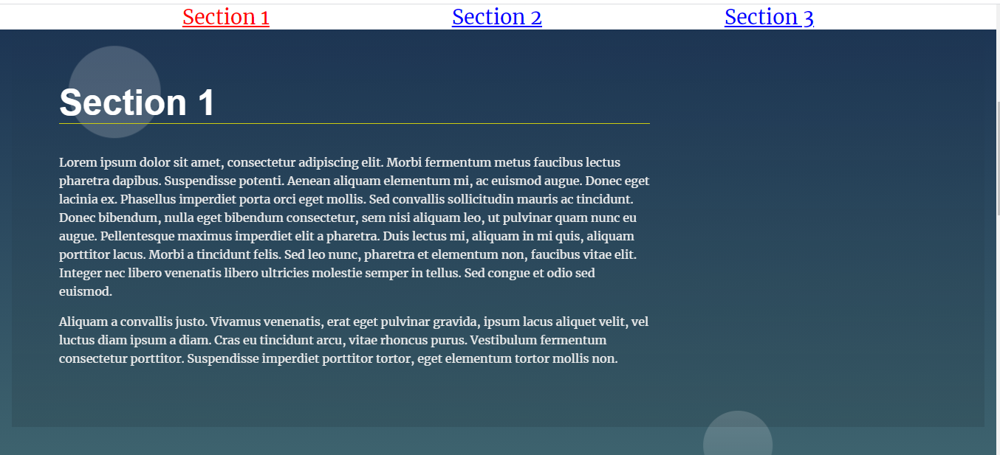

# Landing Page Project

## Table of Contents

* landing-page/css/style.css - This style sheet is used for making the web page look attractive.
* landing-page/css/app.js - This js file is used to make web page dynamic.
* landing-page/index.html

## Project Overview

* Often times, we won’t know how much content will be added to a page through a Content Management System (CSM) or an API. To handle this problem, we will dynamically add content to a web page. 
* The navigation menu of this web page is build from the content available , as we keep adding more content the navigation menu keeps on changing.

* The section which is on the viewport is highlighted i.e. if you scroll the page and go to other section then that section is highlighted in red as above.

